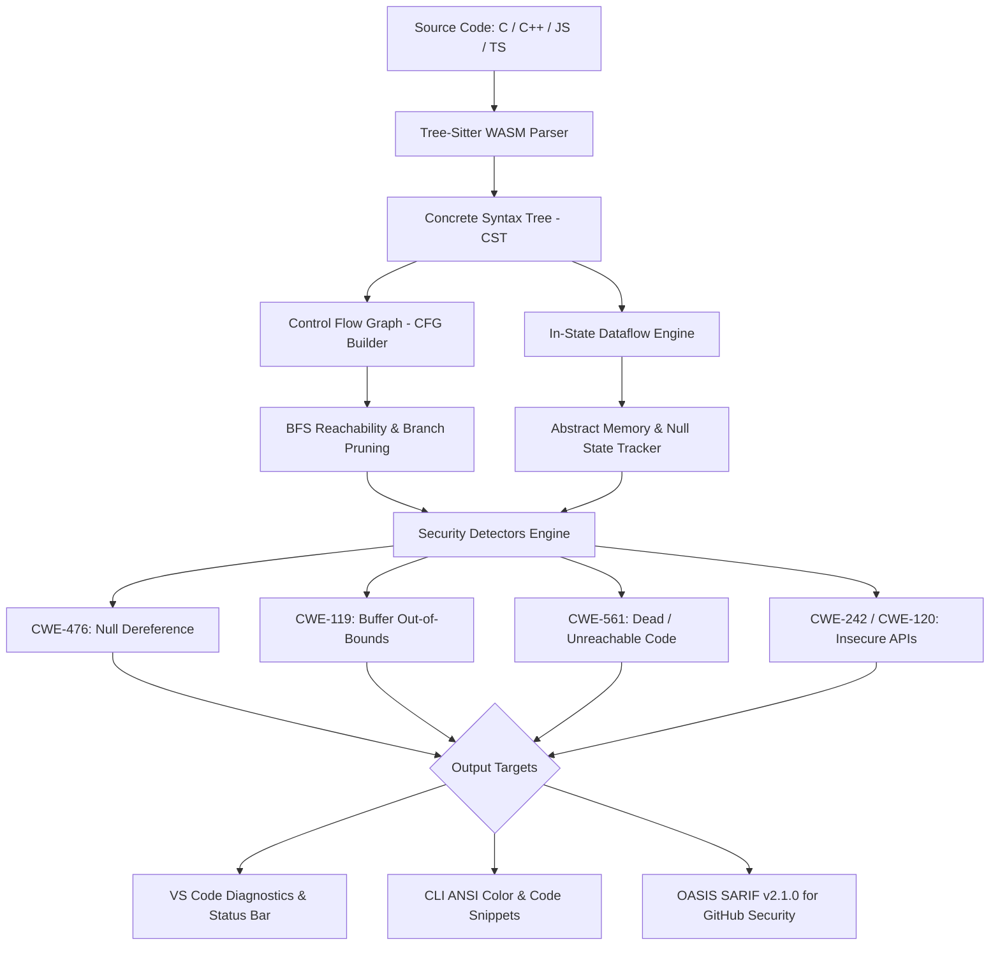

# Compiler-Assisted Security Analyzer

[](https://github.com/Loveneet0003/compiler-based-security-analyser/actions/workflows/ci.yml)
[](https://opensource.org/licenses/MIT)
[](https://www.typescriptlang.org/)
[](https://webassembly.org/)
[](https://sarifweb.azurewebsites.net/)

> **Shift-Left Static Application Security Testing (SAST)**: A high-performance compiler-assisted static security analyzer operating across **C, C++, JavaScript, and TypeScript**. Built on **WebAssembly Tree-Sitter parsers**, **Control Flow Graphs (CFG)**, and **Abstract Data Flow Analysis** to detect memory vulnerabilities, pointer flaws, and logic defects directly inside the IDE and CI/CD pipelines.

---

## 🔍 System Architecture

The analyzer avoids brittle regex matching by parsing source code into concrete syntax trees (CST) using WASM grammars, constructing intra-procedural Control Flow Graphs, propagating abstract variable states, and flagging vulnerabilities against standardized **Common Weakness Enumerations (CWE)**.



---

## 🛡️ Detected Vulnerabilities & CWE Matrix

| Rule ID | Standard | Vulnerability Name | Languages | Severity | Description |
| :--- | :--- | :--- | :--- | :--- | :--- |
| **`SEC001`** | **CWE-561** | Dead / Unreachable Code | C, C++, JS, TS | `MEDIUM` | Detects statements rendered unreachable by unconditional returns, throws, or fully exiting if-else branches. |
| **`SEC002`** | **CWE-476** | NULL Pointer Dereference | C, C++, JS, TS | `CRITICAL` | Discovers dereferences (`*ptr`, `ptr->field`, `obj.prop`, `arr[i]`) on statically null variables before re-assignment. |
| **`SEC003`** | **CWE-119 / CWE-787** | Buffer Overflow / Underflow | C, C++, JS, TS | `CRITICAL` | Pinpoints out-of-bounds array reads and writes ($index \ge size$ or $index < 0$) across static buffers and typed arrays. |
| **`SEC004`** | **CWE-242 / CWE-120** | Insecure Memory APIs | C, C++ | `CRITICAL` / `HIGH` | Flags dangerous APIs without bounds checks (`gets()`, `strcpy()`, `strcat()`, `sprintf()`) and suggests safe alternatives. |
| **`SEC004`** | **CWE-95** | Arbitrary Code Execution | JS, TS | `CRITICAL` | Detects dynamic evaluation via `eval()`, exposing applications to code injection. |

---

## 🚀 Features

- **⚡ Sub-Millisecond Analysis via WebAssembly**: Tree-Sitter parsers compiled to `.wasm` run directly in Node.js and VS Code without native compilation toolchain hurdles.
- **🎨 Interactive CLI with Code Snippets**: ANSI color-coded diagnostic reports highlighting exact line, column, and caret pointer (`^---`) to the vulnerability point.
- **📊 GitHub Code Scanning Native (SARIF)**: Exports OASIS SARIF v2.1.0 reports, enabling automated GitHub PR annotations and CI security gating.
- **💻 VS Code Extension**:
  - Live red-squiggle error/warning diagnostics on open and save.
  - Interactive Status Bar posture widget (`$(shield) Security: 3 issues`).
  - Command Palette integration (`Security Analyzer: Analyze Current File`).

---

## 📦 Installation & Quick Start

### 1. Prerequisites
- **Node.js**: `v18.x` or higher
- **npm**: `v9.x` or higher

### 2. Clone & Build
```bash
git clone https://github.com/Loveneet0003/compiler-based-security-analyser.git
cd compiler-based-security-analyser
npm install
npm run build
```

---

## 💻 CLI Usage

### Run Default Test Suite
```bash
npm run analyze
```

### Scan a Specific File or Directory
```bash
node test-cli.js test/vulnerable.c
node test-cli.js src/
```

### Export to SARIF (for GitHub Security / CI)
```bash
node test-cli.js --sarif > security-report.sarif
```

### Export JSON Summary
```bash
node test-cli.js --json
```

---

## 🧪 Example Output

```text
======================================================================
   Compiler-Assisted Security Analyzer (Static CST & Dataflow)        
======================================================================

✖ test/vulnerable.c (c)
   CRITICAL  SEC002 [CWE-476] Security Vulnerability: Possible Null Pointer Dereference on 'ptr'.
  --> test/vulnerable.c:16:5
    16 |     *ptr = 42; // Dereference of NULL pointer!
       |     ^--- [Vulnerability Point]

   CRITICAL  SEC003 [CWE-119] Security Vulnerability: Buffer Bounds Violation. Index 15 is out of bounds for buffer of size 10 on 'local_buffer'.
  --> test/vulnerable.c:22:5
    22 |     local_buffer[15] = 'Z'; // Out of bounds write (size 10, index 15)
       |     ^--- [Vulnerability Point]

   CRITICAL  SEC004 [CWE-242] Use of inherently dangerous function 'gets()'. Buffer overflow cannot be prevented; use 'fgets()' instead.
  --> test/vulnerable.c:34:5
    34 |     gets(user_input); // Inherently insecure: gets() does not check boundary limits
       |     ^--- [Vulnerability Point]

------------------------- SCAN SUMMARY -------------------------
  Files Analyzed:    2
  Total Issues:      16
    • Critical:     12
    • High:         1
    • Medium:       3
    • Low:          0
----------------------------------------------------------------
```

---

## 🛠️ VS Code Extension Setup

1. Open the project in **VS Code**.
2. Press `F5` to launch an **Extension Development Host**.
3. Open any `.c`, `.cpp`, `.js`, or `.ts` file (e.g., `test/vulnerable.c`).
4. Vulnerabilities are highlighted in real time in the **Problems** tab and annotated directly in the editor.

---

## 🧠 Engineering Highlights & Design Decisions

1. **Why Concrete Syntax Trees (CST) with Tree-Sitter?**
   Traditional linter approaches relying on regular expressions fail when code spans multiple lines or contains complex nested expressions. Tree-Sitter creates concrete parse trees in sub-milliseconds, allowing reliable identification of AST nodes such as `subscript_expression`, `call_expression`, and `pointer_expression`.

2. **In-State vs Out-State Data Flow Modeling**
   To catch errors like `*ptr = 42;` without triggering false positives on variable initialization (`int *ptr = NULL;`), the engine maintains an `inState` snapshot before evaluating each statement. This mirrors standard production compiler data-flow frameworks.

3. **Graph Reachability Algorithm**
   Unreachable code detection evaluates statements against a breadth-first search (BFS) traversal initialized from the program entry node. Blocks preceded by terminating jumps (`return`, `throw`) or fully terminal branching are accurately isolated.

---

## 📄 License

This project is licensed under the [MIT License](LICENSE).
